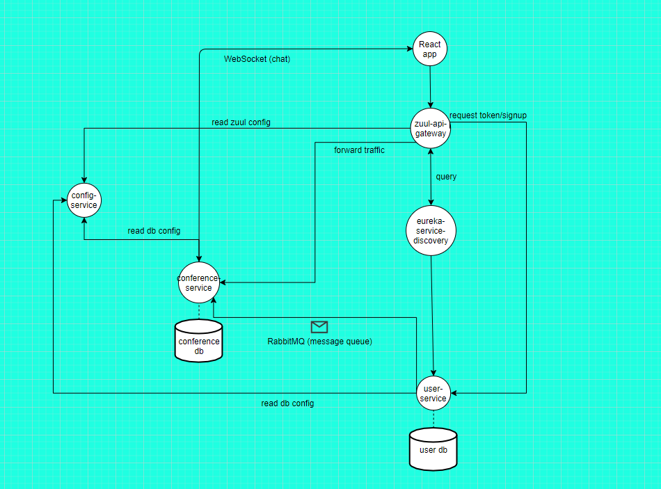

# basic-netflix-oss-scalable-systems
A conference management app implementation using Spring Cloud Netflix for the microservices and a client app using React.
It encompasses multiple technologies:
- Netflix: Eureka, Ribbon, Zuul
- RabbitMQ
- Spring Cloud Config
- JWT
- React

